# 列表 List

> 研发文档：[Preference](https://mi.feishu.cn/wiki/HY7UwwGw4i7AAbkEe1ic5SGvnwh)
>
## 一、概述

列表是展示重复性内容的常用界面元素，良好的列表设计可以提高用户的浏览和查找效率。它帮助用户在设置、消息、联系人等场景中快速浏览、定位并操作一组结构相近的信息行。

列表作为可以按组展示信息的控件，也提供多种交互的能力例如可以进行开关、设置、增删等功能。

关于列表的布局能力以及组合能力可以参考[MIUIX Preference 组件](https://mi.feishu.cn/wiki/HY7UwwGw4i7AAbkEe1ic5SGvnwh)。

## 二、核心原则

- **识别性**：列表项的层级和结构必须清晰可见，用户能快速区分主信息与辅助信息

- **可扫描性**：同一分组内对齐、间距与信息位保持一致，使用户可纵向扫视而非逐字阅读

- **层次性**：主信息、副信息、分组标题需在视觉上区分明确，避免信息堆叠

- **可操作性**：在需要时，列表项应支持点击、滑动、选择等交互，并保证操作区域清晰可识

## 三、类型结构

### 3\.1 类型

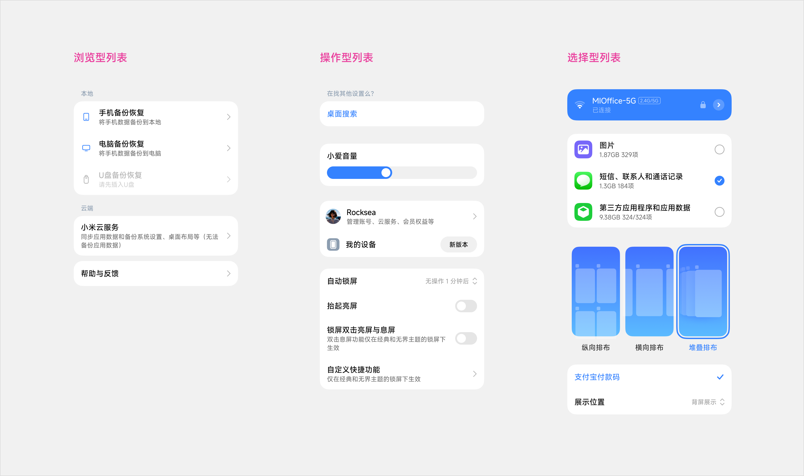

|类型|用途与行为|
|---|---|
|浏览型列表 |- 用于浏览信息或进入下一级内容 - 列表项以文本为主，可搭配图标 - 点击整行完成跳转|
|操作型列表 |- 用于在当前页面直接完成设置或内容调整 - 点击整行或开关控件可切换功能状态 - 需要调整选项时，点击整行打开[近手菜单](https://mi.feishu.cn/wiki/Yw7kwe74Li5tC8ki8RGcBzQhnWc)完成选择 - 列表项包含添加或移除控件时，仅控件响应增删操作 - 展开折叠列表用于在当前页面显示或隐藏附属内容 - 排序类型|
|选择型列表 |- 用于从一组文本或图形选项中选择一个或多个结果 - 图形选项可使用图片、图标、色块或样式预览表达 - 点击列表项或图形选项切换选中状态，并显示清晰的选中标识|
|~~复合型列表~~||

### 3\.2 结构

#### 单列表结构

单个列表项包含头部、文本和尾部三个区域

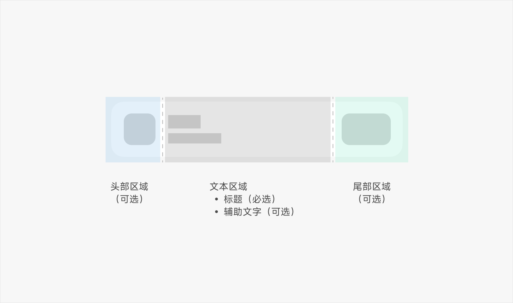

|区域|必需|内容与规则|
|---|---|---|
|头部区域|否|- 用于图形化识别列表内容 - 单个列表项最多使用一个头部图形 - 可选用 Badge、系统图标、头像、应用图标|
|文本区域|是 |- 主标题为必选内容，应简洁明确并能独立表达主要信息 - 辅助文字按需使用，用于补充主标题 - 不应重复主标题，宜使用短语或短句 - 末尾不加句号，避免直接称呼用户|
|尾部区域|否|- 用于展示当前值、状态或操作入口 - 可使用文本、入口箭头、开关、功能图标|

#### 列表组结构

当内容条目或种类过多时，适当使用分组或分类有助于用户快速定位内容，应使用分组标题

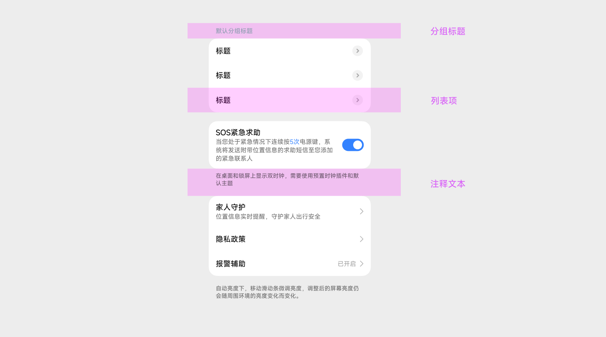

|元素|规则|
|---|---|
|列表项|- 承载一条完整的信息或操作 - 同组内的结构和对齐方式应保持一致|
|分组标题 |- 用于说明一组列表项的内容关系 - 通常不承载主要业务操作 - [MIUIX 标题](https://mi.feishu.cn/wiki/B4HuwTmRfitI1skU7USc1fs5nyf)|
|分割线|- 用于区分相邻内容或不同内容块 - 套卡列表使用套卡分割线，区分卡片内的展开内容或图文区域 - 通栏列表使用不套卡分割线，划分页面内容块 - [MIUIX 分割线](https://mi.feishu.cn/wiki/IYTGwE5zsi4QqykJzExc980nn5c) |
|[注释文本](https://mi.feishu.cn/wiki/ZvLNwQi1Si3Zbgk1calcmKZ7nSd?from=from_copylink)|- 用于单独展示与当前列表组相关的补充说明 - 仅包含文本信息，不承载主要操作 - [MIUIX 注释](https://mi.feishu.cn/wiki/S0oTwgR1aibtbWkf5G2cipQLnfc)|

## 四、交互状态

### 4\.1 列表状态

用户对于列表操作需要提供明确的反馈状态，列表包含明确的点击态、选中态以及激活态等事件

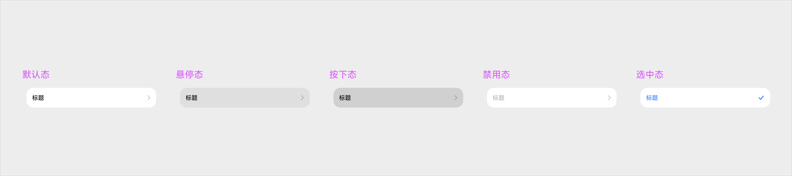

|状态|触发条件|视觉变化|
|---|---|---|
|默认|条目可用且未聚焦|使用默认表面与文本层级|
|按下|手指/指针按下可点条目|即时按压反馈|
|选中|选择型列表中被选中|勾选、高亮或等效选中指示 单选互斥；多选可累加|
|禁用|不可用|降低文本与图标强调|
|聚焦|通过键盘、遥控器或辅助输入将焦点移动到可交互条目|显示焦点描边、焦点背景或等效高亮|
|悬停|鼠标或触控板指针停留在可交互条目上|显示轻量的悬停背景或颜色变化|

### 4\.2 列表选中规范

#### 选中标识位置

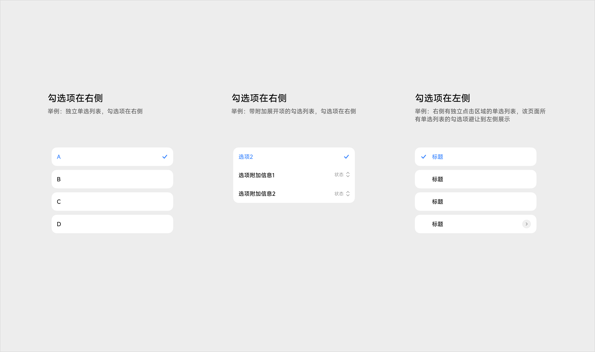

HyperOS 系统内的单选列表，选中标识默认显示在右侧。当列表右侧已有独立点击区域时，选中标识应避让至左侧；同一页面内的单选列表应保持一致。该规则同样适用于菜单、近手菜单等使用相同选中表达的组件。

#### 选中状态的生效方式

- **即时生效**：点击选项后立即生效，数据实时同步。选中项不使用轮廓底色，显示对勾，文字颜色不变
- **确认后生效**：选择后保持临时状态，点击确认或提交按钮后生效，适用于批量处理。选中项使用轮廓底色，显示对勾，文字颜色不变

### 4\.3 展开与折叠

展开与折叠用于原地显示或隐藏列表项的附属内容。内容从列表项下方向下展开。折叠时指示图标向下，展开时指示图标向上。

#### 交互热区

- **仅含展开操作**：列表项只用于展开和折叠时，整行均为触发热区。指示图标位于尾部，点击任意位置均可切换状态
- **包含独立操作**：列表项同时提供其他操作时，展开指示图标应放在标题旁，文本区域与指示图标共同作为展开、折叠热区；其他控件使用独立热区，不应触发展开或折叠

#### 展开内容

- 展开内容可使用列表、图表等形式
- 展开内容为列表时，其头部区域应增加缩进；为其他内容时，应使用分割线与触发项区分

### 4\.4 列表的组合规范

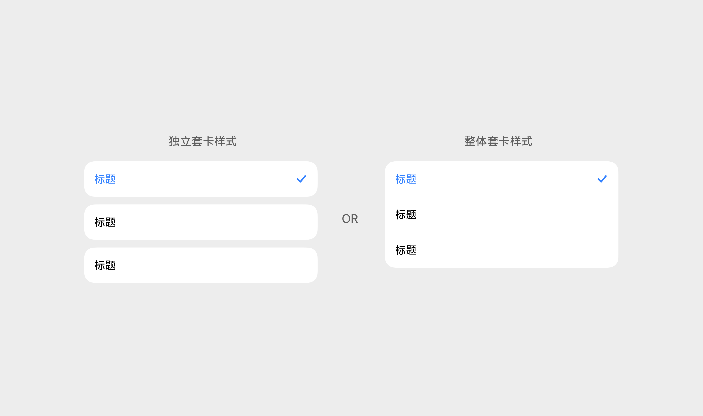

信息之间有较强相关性的列表项，尽量成一组使用整体套卡的样式，信息浏览效率更高。比如在设置应用中，同一类功能/应用的设置尽量整体套卡。当一组列表内容过多时请使用分组标题分割成多个成组卡片。

**如何判断是否应该组合：**

- 彼此为某一信息子集且并列，建议用组合性质的列表

- 当有选项选中时有展开的附加信息时，推荐使用独立的卡片列表组合

- 信息之间没有相关性或彼此之间成互斥关系，建议使用独立的列表项

### 4\.5 列表文字的挤位

当尾部区域使用文本且内容较长时，应优先保证左侧主标题和辅助文字的展示空间，左侧文本区域不应被完全挤压。

#### 折行规则

- 左侧主标题和辅助文字不限制折行行数，可根据业务内容调整
- 用于“文案 + 进入二级页面”或“文案 + 打开近手弹窗”的右侧文本，最多显示三行，超出部分使用省略号

#### 宽度分配

以下尺寸以列表项可分配宽度为 336dp 为基准：左侧内容区、20dp 间距与尾部区域的宽度之和应保持为 336dp。

|区域|宽度|分配规则|
|---|---|---|
|左侧内容区|200～264dp|优先分配展示空间，宽度随尾部区域增加而缩减，最小保留 200dp|
|区域间距|20dp|左侧内容区与尾部区域之间保持固定间距|
|尾部区域|52～116dp|内容较少时使用最小宽度 52dp；内容增加时可扩展，最大不超过 116dp|

- 左侧包含图标时，图标、图标间距和文本共用左侧内容区的宽度，不额外增加区域宽度
- 尾部区域达到 116dp 后，不应继续挤压左侧内容区；超出内容按折行规则处理

## 五、视觉规格

### 5\.1、颜色

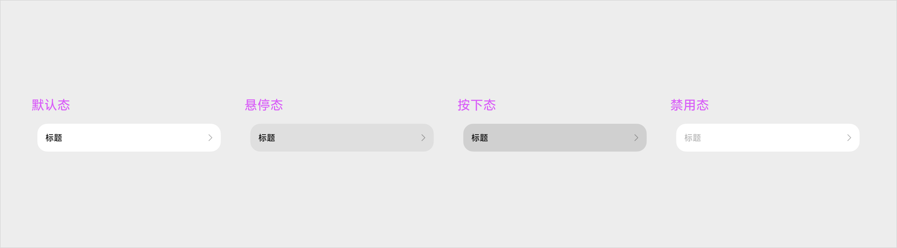

|**浅色模式** |**常态** **Normal**|**悬停** **Hovered**|**按下** **Pressed**|**聚焦** **Focused**|**禁用** **Disabled**|
|---|---|---|---|---|---|
||Bg `miuix_comp_list_color_fill_enabled` Text `miuix_color_text_primary_enable`|Bg `miuix_comp_list_color_fill_hover` Text `miuix_color_text_primary_enable`|Bg `miuix_comp_list_color_fill_pressed` Text `miuix_color_text_primary_enable`|暂无|Bg `miuix_color_bg_layout_white_page` Text `miuix_color_text_octonary_enabled`|
|**深色模式** |**常态** **Normal**|**悬停** **Hovered**|**按下** **Pressed**|**聚焦** **Focused**|**禁用** **Disabled**|
||Bg `miuix_comp_list_color_fill_enabled` Text `miuix_color_text_primary_enable`|Bg `miuix_comp_list_color_fill_hover` Text `miuix_color_text_primary_enable`|Bg `miuix_comp_list_color_fill_pressed` Text `miuix_color_text_primary_enable`|暂无|Bg `miuix_color_bg_layout_white_page` Text `miuix_color_text_octonary_enabled`|

### 5\.2、尺寸

#### 列表左侧元素

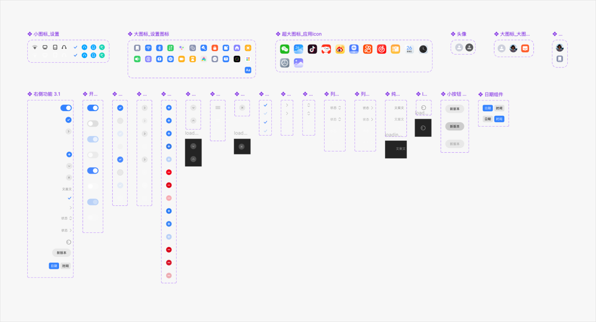

|左侧标识类型|尺寸|说明|
|---|---|---|
|系统图标|- 24 × 24|用于系统功能、状态或通用操作|
|设置图标|- 28 × 28|用于识别设置功能，避免与应用图标混用|
|应用图标|- 40 × 40|用于标识具体应用或服务，保留品牌图形与颜色|
|头像|- 28 × 28 - 34 × 34|用于用户、联系人或账号识别|

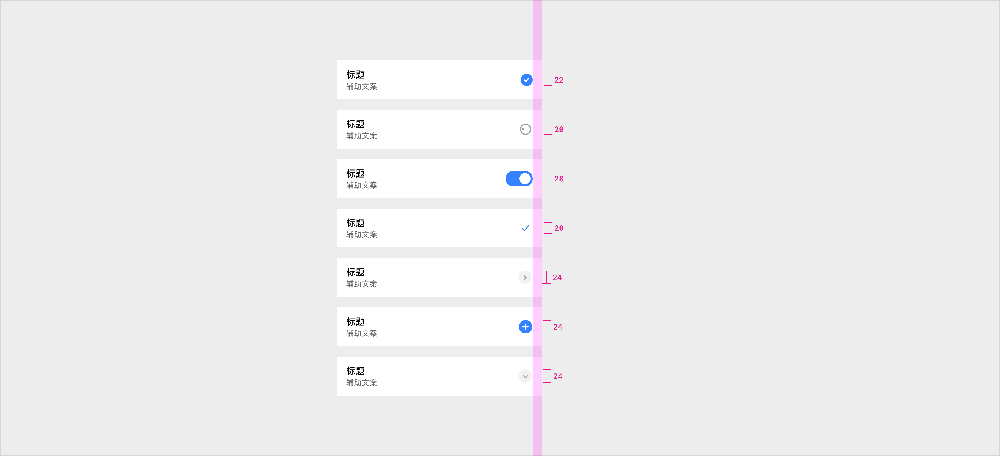

#### 列表右侧元素

|右侧标识类型|尺寸|说明|
|---|---|---|
|开关|- 49 × 32|- 用于直接开启或关闭功能，操作后状态应立即生效 - 整行与开关均可响应点击时，两者应执行相同操作|
|多选|- 28 × 28|- 用于多选场景，显示列表项的未选中或已选中状态|
|增删|- 26 × 26|- 用于添加或移除当前列表项|
|展开收起|- 28 × 28|- 用于在当前页面展开或收起附属内容，图标应随展开状态同步变化|
|选择|- 20 × 20|- 用于标记单选场景中的当前选中项，仅表达选择状态|
|加载|- 26 × 26|- 用于表示当前列表项正在处理或等待结果|
|按钮|- 82 × 36|- 用于承载明确的行内操作，按钮文案应简短|
|日期时间|- 44 × 28|- 用于展示当前日期或时间值 - 需要修改时，点击列表项或该区域进入对应选择器|
|二级入口（独立）|- 40 × 40|- 用于进入与列表项相关的独立二级功能，应使用明确图标和独立热区，避免与整行入口产生歧义|

### 5\.3、布局

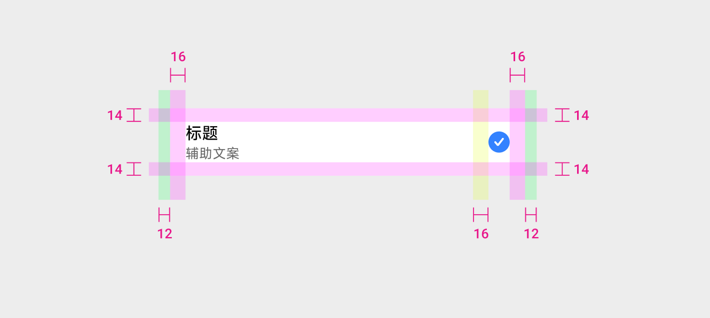

#### 套卡列表

**Margin 左右外边距：**

- 列表项内容与容器左右边缘保持 12dp 间距

- 在不同容器场景下，基于[统一边距组件](https://mi.feishu.cn/wiki/DBmNwgb4YiIpXgkG4x9c2xmXnAf?from=from_copylink)进行动态变化

**Padding 左右内边距：**

- 列表项内容与自身左右边缘保持 16dp 间距

**Gap 文本区域与尾部区域间距：**

- 尾部区域存在时，与文本区域保持 16dp 间距

- 无尾部区域时，文本区域延伸至列表项右侧内边距

**垂直对齐：**

- 头部图形和尾部控件相对列表项垂直居中

- 主标题与辅助文字组成的文本块整体垂直居中

**列表项高度根据文本行数确定：**

- 单行列表项高度为 56dp，双行列表项高度为 70dp

- 文本达到三行及以上时，列表项不再使用固定高度，其总高度由内容区高度与上下内边距（14dp）共同决定

#### 非套卡列表

列表项通栏排列，不使用套卡背景和外轮廓圆角。

**Margin 左右外边距：**

- 列表项内容与容器左右边缘保持 12dp 间距
- 在不同容器场景下，基于[统一边距组件](https://mi.feishu.cn/wiki/DBmNwgb4YiIpXgkG4x9c2xmXnAf?from=from_copylink)进行动态变化

**Padding 左右内边距：**

- 无头部图形时，文本区域与列表项左右边缘保持 16dp 间距
- 使用头部图形时，头部图形尺寸为 28dp，与文本区域保持 16dp 间距

**Gap 文本区域与尾部区域间距：**

- 尾部区域存在时，与文本区域保持 16dp 间距
- 无尾部区域时，文本区域延伸至列表项右侧内边距

**垂直对齐：**

- 头部图形和尾部控件相对列表项垂直居中
- 主标题与辅助文字组成的文本块整体垂直居中

**列表项高度根据文本行数确定：**

- 列表项上下内边距均为 14dp
- 列表项高度随文本行数增加，文本达到三行及以上时不使用固定高度

### 5\.4、圆角

列表组外轮廓使用 20dp 圆角。圆角仅作用于列表组的外侧边缘，组内相邻列表项的连接边保持直角，使列表在视觉上形成连续整体。

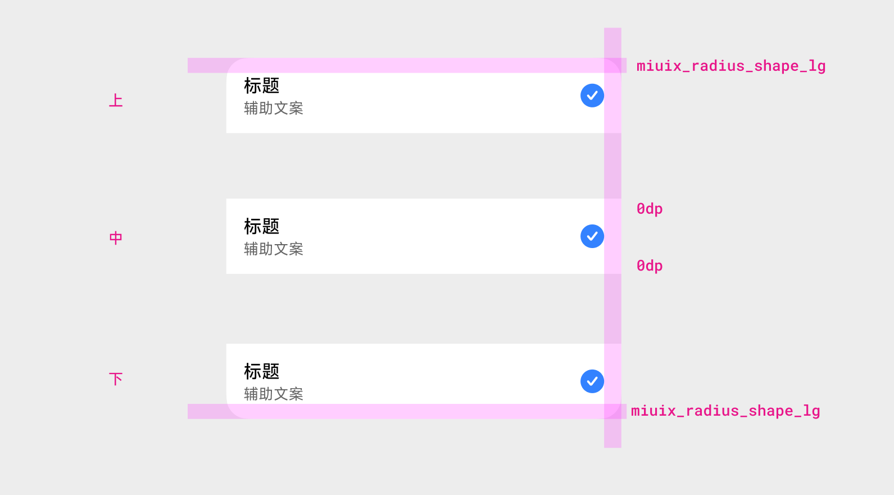

**单项列表组**

- 四个角均为 20dp `miuix_radius_shape_lg`

**首个列表项**

- 左上角和右上角为 20dp`miuix_radius_shape_lg`，底部两角为 0dp

**中间列表项**

- 四个角均为 0dp

**末个列表项**

- 左下角和右下角为 20dp`miuix_radius_shape_lg`，顶部两角为 0dp

## 六、多端设计指南

列表在不同设备间适配或流转时，应保持信息结构、排列顺序和操作位置一致。

- 列表左右外边距应遵循[统一边距组件](https://mi.feishu.cn/wiki/DBmNwgb4YiIpXgkG4x9c2xmXnAf?from=from_copylink)，根据设备形态和窗口宽度使用对应档位
- 中间区域应优先吸收窗口宽度变化，为标题、辅助文字和尾部信息提供更多展示空间
- 头部图标、尾部控件及区域间距应保持组件规定的尺寸，不随屏幕宽度等比放大
- 手机使用手机端边距档位；折叠屏展开态和平板应增加左右外边距，并适当扩展中间区域
- 大屏设备不应直接沿用手机端边距，也不应将列表内容无约束地铺满屏幕

## 七、大字体适配

列表应跟随系统字体缩放设置，最高支持 200% 放大系数。

### 7\.1 适用范围

- 适配范围覆盖直板手机、折叠屏和平板
- 一级和二级业务模块中的列表场景均应支持大字体，必须包含设置和搜索场景

### 7\.2 布局模式

- 字体放大系数低于 170% 时使用标准列表布局
- 字体放大系数达到 170%～200% 时切换为大字列表布局
- 应优先使用 MIUIX 提供的大字体布局能力，不应由业务自行等比放大组件
- 切换布局后，应保持列表的信息结构、排列顺序和操作方式不变

### 7\.3 内容与交互

- 主标题和辅助文字可根据内容折行，列表项高度随内容增加
- 不应通过缩小字号、压缩行高或裁切内容维持固定高度
- 卡片背景、分割线和选中背景应随列表项高度同步调整
- 左右文本发生空间冲突时，应遵循 4.5 文本挤位规则；大字布局下仍无法清楚展示时，应改为上下布局或将尾部文本移至主标题下方
- 图标、开关、勾选和展开指示应使用 MIUIX 对应的大字体规格，不应随字体倍率直接等比缩放
- 文字折行后，不应遮挡或挤压尾部控件，列表项和行内控件的触控热区不得缩小
- 切换字体档位后，列表的选中、展开和操作状态应保持不变
